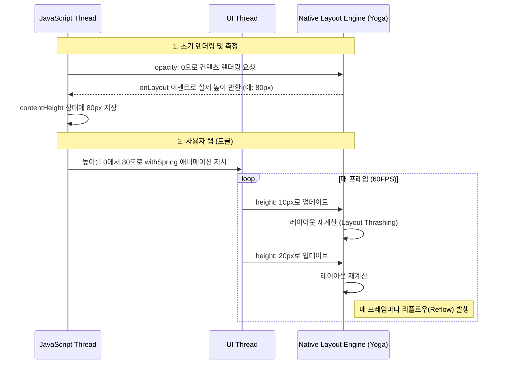
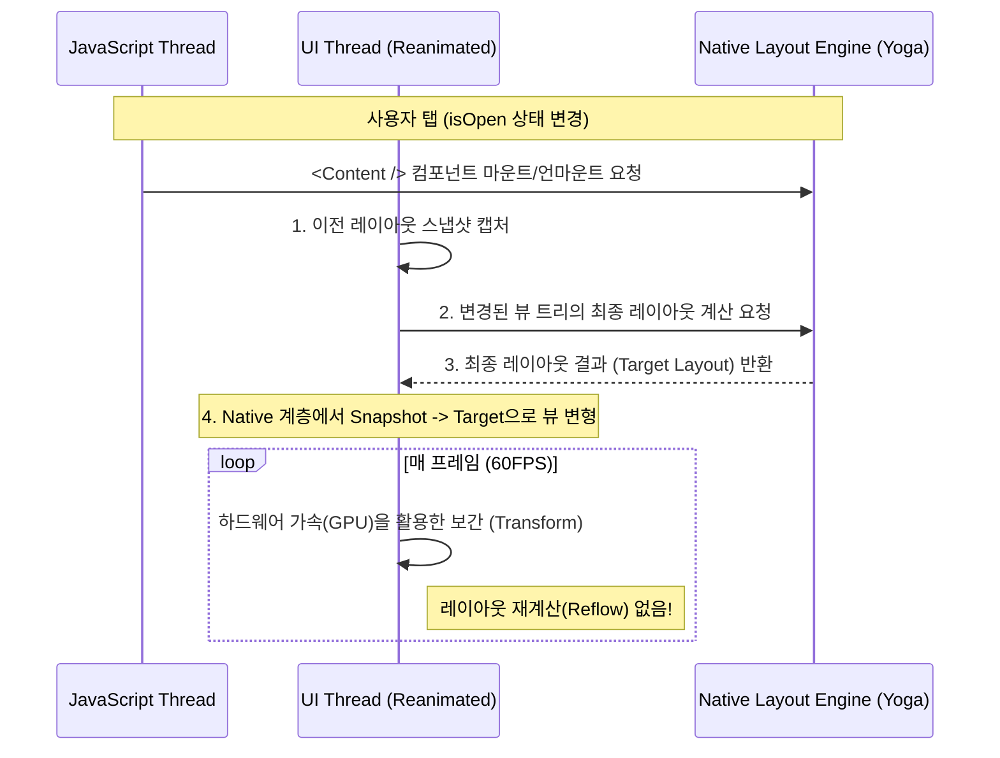

# React Native Reanimated: 아코디언 컴포넌트 아키텍처 및 최적화 전략

본 문서는 React Native 환경에서 가변 높이(Dynamic Height)를 가지는 아코디언(Accordion) 컴포넌트를 구현할 때 발생하는 성능 저하의 원인과, 이를 해결하기 위한 Reanimated 3의 최신 실무 아키텍처(Layout Animations)에 대해 기술합니다.

---

## 1. 기존 아키텍처의 한계 (Legacy onLayout & Height Animation)

과거 Reanimated 2 환경이나 순수 React Native의 `Animated` API를 사용할 때 표준적으로 사용되던 방식입니다. 컨텐츠의 높이를 사전에 측정한 뒤, 매 프레임마다 `height` 값을 직접 보간(Interpolation)하여 애니메이션을 수행합니다.

### 1.1. 동작 원리



### 1.2. 기술적 문제점 (버벅임의 원인)

1. **레이아웃 스래싱(Layout Thrashing)**:
   CSS나 React Native에서 요소의 `height`, `width`, `margin`, `padding` 등을 매 프레임 조작하면, Layout Engine(Yoga)은 해당 요소뿐만 아니라 영향을 받는 모든 부모/자식/형제 요소의 위치를 매 프레임 다시 계산해야 합니다. 이는 막대한 CPU 연산을 요구하며 프레임 드랍(버벅임, Stuttering)의 주원인이 됩니다.
2. **비동기 측정 지연**:
   `onLayout`은 비동기로 동작합니다. 컴포넌트가 마운트된 후 Native 레이아웃 계산이 완료되어야 JS 스레드로 이벤트가 전달됩니다. 이 과정에서 레이아웃 렌더링 사이클이 여러 번 돌게 되어 코드가 복잡해집니다.
3. **오버스슛 클램핑(Overshoot Clamping)의 부작용**:
   스프링 애니메이션 시 높이가 목표치를 초과하여 튕기는 현상을 막기 위해 `overshootClamping: true`를 강제하면, 애니메이션이 종료 지점에 도달했을 때 감속 없이 급격하게 정지하게 되어 부자연스러운 시각적 끊김이 발생합니다.

---

## 2. 최신 실무 아키텍처 (Reanimated 3 Layout Animations)

Reanimated 3에서 도입된 `LayoutAnimations`(`LinearTransition`)를 사용하면 수동으로 `height`를 계산하고 매 프레임 레이아웃을 강제 업데이트하는 행위를 원천적으로 제거할 수 있습니다.

### 2.1. 동작 원리

개발자는 단순히 조건부 렌더링(`isOpen && <Content />`)만 수행하고, 부모 뷰에 `layout={LinearTransition}`을 선언합니다. 나머지는 Reanimated가 Native 계층에서 자동으로 처리합니다.



### 2.2. 최적화된 코드 구조

1. **상태 관리의 단순화**: 
   `contentHeight` 상태 및 `onLayout` 콜백이 완전히 제거됩니다. 오직 `isOpen` 상태에 따라 뷰를 렌더링할지 말지만 결정합니다.
2. **높이(Height) 대신 레이아웃(Layout) 제어**:
   `height` 스타일 속성에 `useAnimatedStyle`을 연결하지 않습니다. 부모 컴포넌트에 `layout={LinearTransition.springify()}` 하나만 부여합니다.
3. **부드러운 마운트 애니메이션 결합**:
   컨텐츠가 단순히 나타나는 것을 넘어, `entering={FadeIn}`과 `exiting={FadeOut}`을 결합하여 컨텐츠가 자연스럽게 스며들도록 연출할 수 있습니다.

```typescript
// 개선된 구조 스니펫
<Animated.View 
  layout={LinearTransition.springify().damping(20).stiffness(120)}
  style={styles.container}
>
  <Pressable onPress={toggle}>
    {/* 헤더 영역 */}
  </Pressable>

  {isOpen && (
    <Animated.View entering={FadeIn} exiting={FadeOut}>
      <Text>{item.answer}</Text>
    </Animated.View>
  )}
</Animated.View>
```

### 2.3. 기술적 이점

- **UI 스레드 완전 이관**: 애니메이션의 전 과정(스냅샷, 목표값 계산, 보간)이 JS 스레드를 거치지 않고 UI 스레드에서만 독립적으로 실행되어 60FPS가 완벽히 보장됩니다.
- **Reflow 억제**: 높이 값을 매 프레임 변경하지 않고, Native 레벨에서 View의 Transform 계층을 보간하므로 Layout Engine(Yoga)의 과부하가 발생하지 않습니다.
- **유지보수성 향상**: 가변 높이를 측정하기 위한 우회 코드(Hack)가 사라져 컴포넌트의 가독성과 안정성이 비약적으로 상승합니다.
